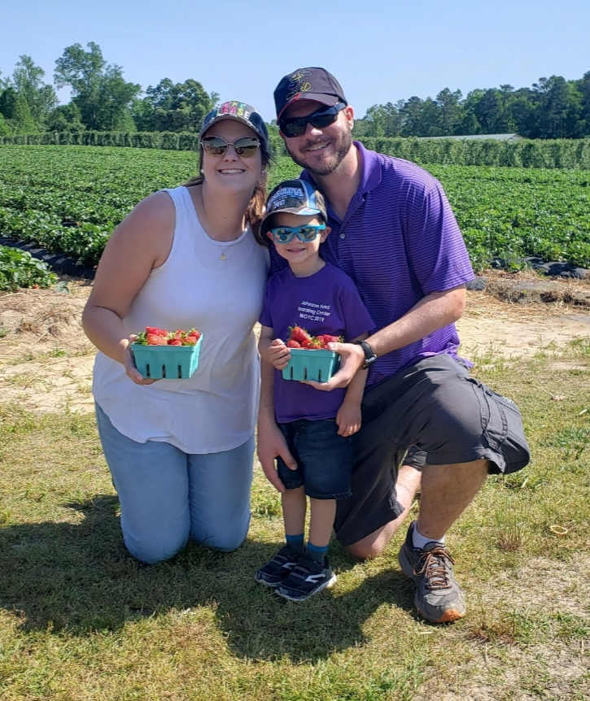
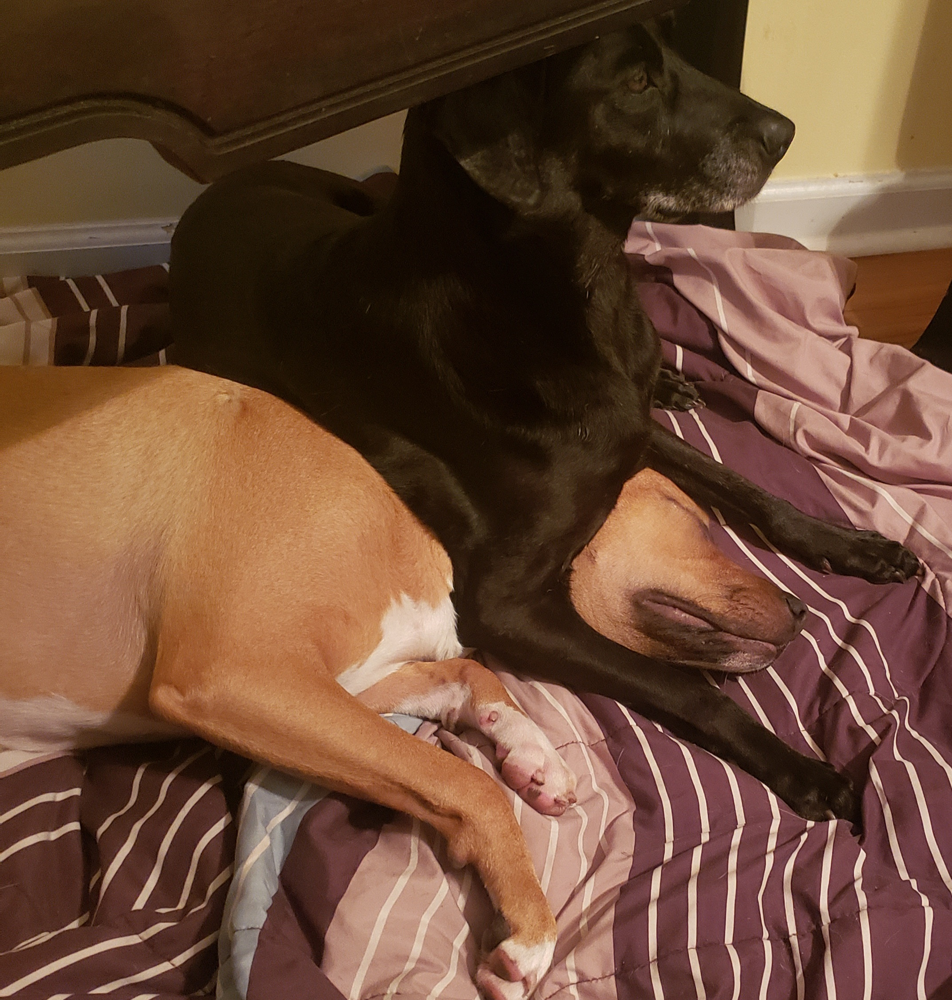

# Kaitlin Page

## About Me
Hello! My name is Kaitlin Page and I am currently a 4th grade teacher at [Willow Springs Elementary School](https://www.wcpss.net/willowspringses) in Wake County. I have been teaching for **10 years**, but will soon be moving on to a new career since this is my last semester in the *Learning Design and Technology* program! I am excited about this class, but also [completely terrified](https://media.giphy.com/media/5e1Tn4N3tX7BfSbQj3/giphy.gif) because I have _**zero**_ coding experience. I'm hoping I will catch on quickly and finish the course with a plethora of new tools at my disposal. 
___
## Family
I have been married to my husband, *Mike*, for almost 9 years. We have a son, *Mikey*, who is 5, and a _**bundle of energy**_. We spend most of our time [chasing after him](https://media.giphy.com/media/G0Eyqn8Gos2Wc/giphy.gif). We also have two dogs, *Sadie* (10) and *Koda* (1). It's safe to say life is never boring at my house! 

___
## Hobbies
In my **(very little)** spare time I enjoy doing many things, but my favorites are: 

1. Watercolor painting
2. Kayaking
3. Reading
4. Hiking
5. Crocheting